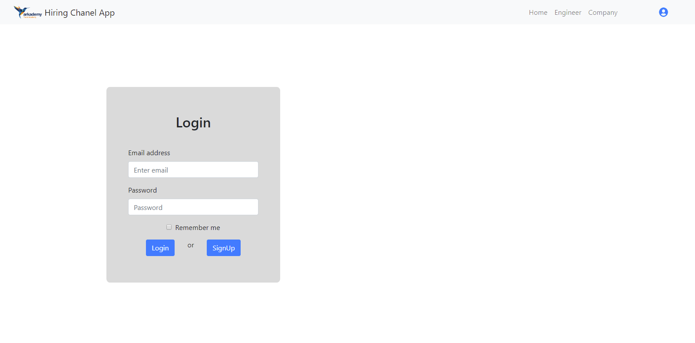
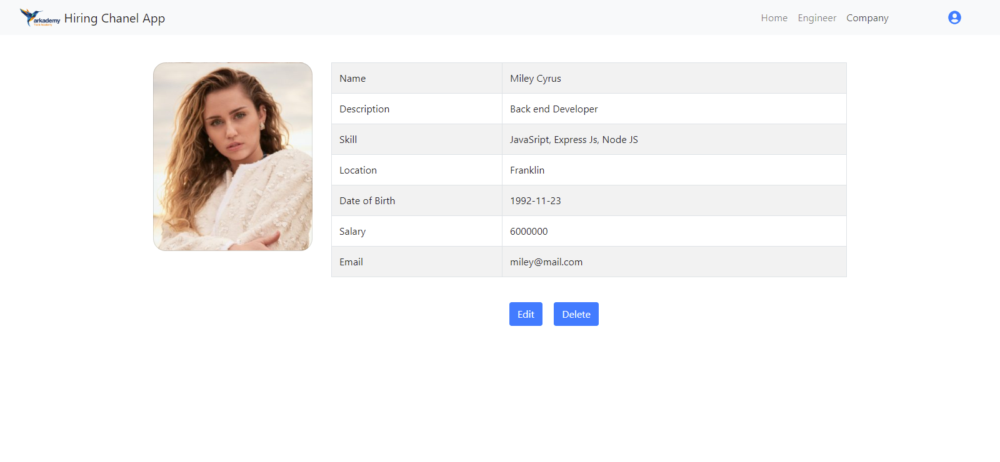
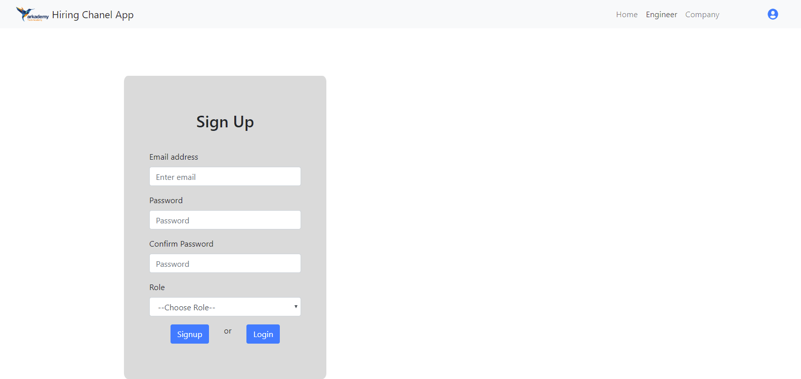

# React Hiring Chanel App 

Hiring Channel App is a feature that allows Engineers and Company to do communicate for looking/hiring jobs. This project for handle frontend only. Built using ReactJS Framework.

## Requirements
1. [Node.js](https://nodejs.org/en/)
2. [Hiring Channel Backend API](https://github.com/alfatahh54/Restful-Api-Hiring-Chanel-App)
3. [React.js](https://reactjs.org/)
4. Web Browser

## Installing
To install reactjs-webfrontend-hiringChannelApp, follow these steps:
1. clone from Github:
```
$ git clone https://github.com/alfatahh54/React-Hiring-Chanel-App.git
```
2. Move folder
```
$ cd reactjs-webfrontend-hiringChannelApp
```
3. install package
```
$ yarn or npm install
```
4. create .env file and fill these with required things
```
REACT_APP_SERVER_URL =
```
run the server
```
$ npm start
```
5. Open browser and enter web url (ex. localhost:3000) and enjoy..

## Backend restfull API
- [Hiring Channel Backend API](https://github.com/alfatahh54/Restful-Api-Hiring-Chanel-App)

## Screenshoot

<div align="center">
    
    
    
    
    
</div>
